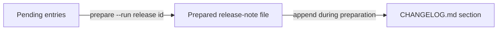
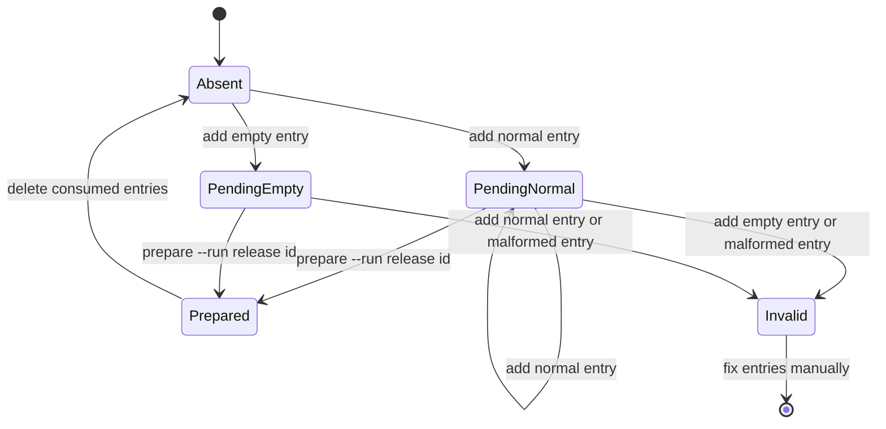
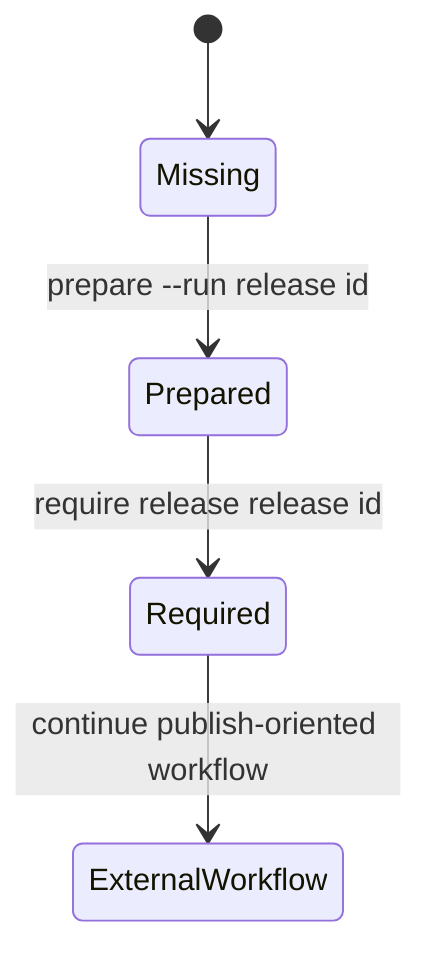
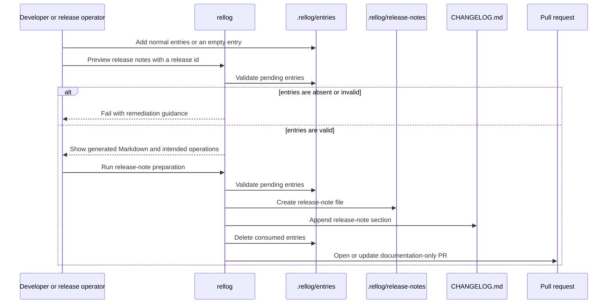

# rellog workflow

This document describes the intended lifecycle and workflow guards for `rellog`.

For file layout and file formats, see [files.md](files.md). For individual command behavior, see [commands.md](commands.md).

## Principle

`rellog` separates development history from release explanation.

Git history records how work was divided and performed. A CHANGELOG records what changed in a release and how that change should be communicated to users, operators, or maintainers.

`rellog` therefore uses explicit changelog entries as its primary input. It does not reconstruct final release notes from commit history.

## Lifecycle overview

`rellog` has three major artifact lifecycles:



The important workflow rule is:

```text
release publishing requires a prepared release-note file
```

`rellog` does not require pending entries to exist throughout ordinary development. In many projects, entries may be added only when the developer remembers, during review, or immediately before release preparation.

That is acceptable. The guard belongs near release preparation and release publishing, not at every development step.

## Pending entry lifecycle

Pending entries are temporary records for the next release explanation.



The `Absent` state is valid during ordinary development. It means only that there is no pending release-note material yet.

The `PendingNormal` state means that the next release has changes to mention.

The `PendingEmpty` state means that the project explicitly records that the next release has no changelog-worthy changes.

The `Invalid` state is a contradiction or malformed record. Examples include:

- an empty entry coexisting with normal entries;
- malformed entry metadata;
- an empty entry body;
- an unknown kind or target, depending on project policy.

Release-note preparation must fail in the `Invalid` state.

## Release-note lifecycle

A release-note file is created only when release preparation is executed with `--run`.



Once prepared, the release-note file becomes the durable per-release Markdown artifact.

`rellog` does not publish it. External tooling may use it to create a GitHub Release, prepare package metadata, update documentation, or perform other release tasks.

## CHANGELOG lifecycle

`CHANGELOG.md` is the cumulative release record.

During `rellog prepare <release-id> --run`, the prepared release-note content is appended to `CHANGELOG.md`.

`CHANGELOG.md` is not the source of pending release explanation. Pending entries are the source. `CHANGELOG.md` is the accumulated output.

## Preparation guard

Release-note preparation is the first guard.

The default `rellog prepare <release-id>` command previews the generated release-note Markdown and intended file operations. It does not create a release-note file, update `CHANGELOG.md`, or delete pending entries. `rellog prepare <release-id> --run` executes those operations after the same validation passes.

Both preview and execution should fail when release-note preparation is impossible or unsafe, for example:

- there are no pending entries;
- normal entries and an empty entry coexist;
- pending entries are malformed;
- the target release-note file already exists;
- the release id is not path-safe.

This guard is intentionally located at preparation time. `rellog` assumes that changelog entries may be written late, because the meaningful release explanation may only become clear after several pieces of work are considered together.

When there are no pending entries, the user should either add normal entries or create an explicit empty entry. The empty entry records that there is nothing changelog-worthy for the release.

## Release-note gate

The release-note gate is the v0 publish-oriented guard.

It should fail unless the prepared release-note file for the release id exists.

This catches the primary failure mode `rellog` is meant to prevent:

```text
trying to release before preparing release notes
```

This guard can be placed before artifact publishing, package publishing, GitHub Release creation, website publication, or any other release-oriented step.

## Release preparation sequence

A typical release preparation sequence is:



If pending entries are absent, release-note preparation fails. This failure is the reminder point: `rellog` does not require perfect entry maintenance throughout ordinary development, but it does require an explicit record before release notes are prepared.

The resulting pull request should contain only `rellog`-managed documentation artifacts:

- create a release-note file;
- update `CHANGELOG.md`;
- delete consumed pending entries.

It should not update versions, update package manifests, create tags, create GitHub Releases, or publish artifacts.

## GitHub Actions workflow role

`rellog` should provide a GitHub Action for a changesets-like experience without version management.

The action layer should be able to:

- prepare a release-note pull request from pending entries;
- fail preparation when pending entries are absent or invalid;
- fail publish-oriented jobs when the prepared release-note file is missing.

The action does not infer final release notes from Git history. It only checks and consumes explicit `rellog` entries when preparing release notes, and later verifies that a release-note file exists before release-oriented workflow steps proceed.

## Future AI-assisted workflow

AI support may be considered after the core workflow is stable.

The acceptable role of AI is to suggest candidate changelog entries from issues, pull requests, diffs, or commit history. The final changelog entry should still be reviewed and accepted as an explicit project record.

In other words, AI may help draft entries, but `rellog` should not silently infer final release notes from Git history.
